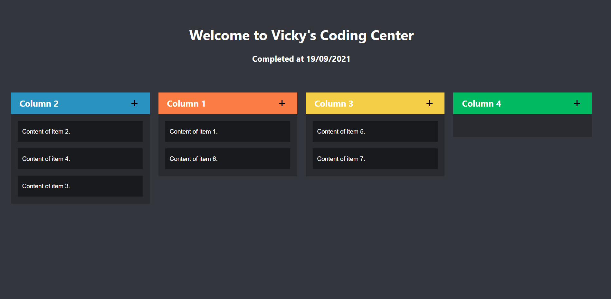
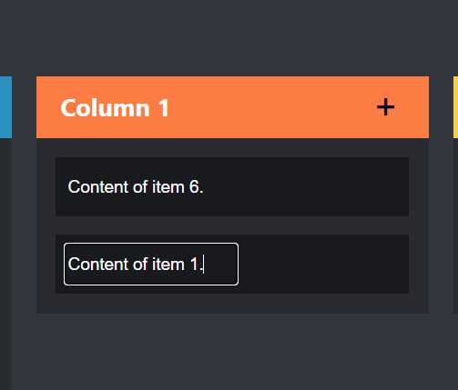
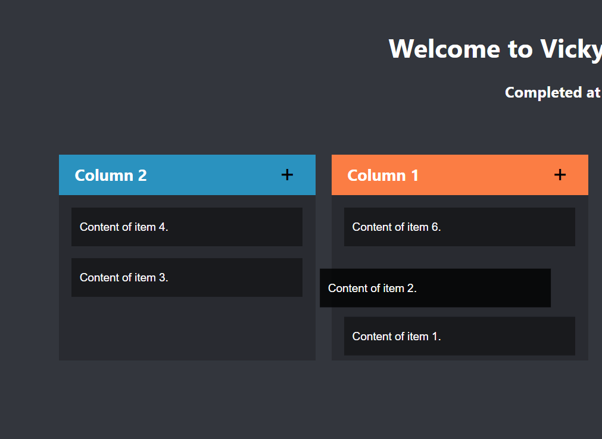
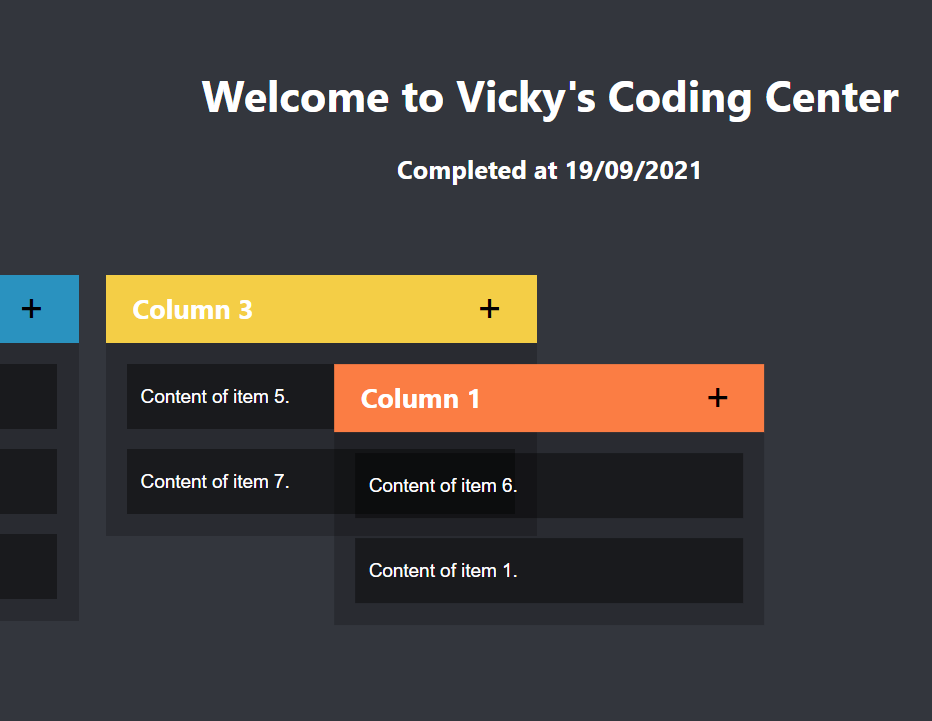

# draggable-application
React & Typescript

## Using react-beatiful-dnd to develop draggable components

  

                              
## Content of each item can be editble
                              
                              

  

   

## Items are draggable among columns

  

 

## Columns are also draggable and swap the position

  

 
